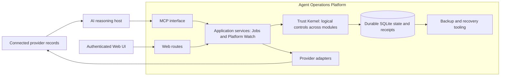

# Agent Operations Platform: architecture and capability boundaries

## Positioning

Agent Operations Platform is a production-oriented platform for governing AI-assisted workflows through durable state, explicit authority and controlled state transitions. Its current reference application is Jobs; Platform Watch supplies a separate report-and-decision workflow. The platform provides operational controls behind agents rather than a general-purpose agent runtime.

Agents reason. The platform governs durable state changes and execution admission.

“Production-oriented” describes design choices such as transactional writes, explicit identity, recovery tooling and repeatable verification. It is not a certification of enterprise scale, availability or compliance.

## Implemented structure

This is a conceptual map of existing code, not a new folder hierarchy. Control checks occur at identity, service, domain and persistence boundaries; there is no single kernel process through which every call passes. Domain services live inside the platform. External systems retain authority over their original records.

| Boundary | Implementation | Responsibility |
| --- | --- | --- |
| MCP | `src/mcp/` | Tool schemas, invocation and service access |
| Authentication and Web | `src/auth/`, `src/web/` | Session/identity boundaries, scoped actions and presentation |
| Application services | `src/application/` | Domain use cases, versioned commands and orchestration of existing checks |
| Domain rules | `src/domain/` | Validation, deterministic transitions and source/evidence contracts |
| Persistence | `src/persistence/`, `db/migrations/` | SQLite state, transactions and schema evolution |
| Integrations | `src/gmail/`, source readers in `src/application/` | Bounded provider reads and source identity |
| Operations | `src/operations/`, `scripts/`, `deploy/cloud/` | Verification, backup, recovery and deployment templates |

## Trust Kernel: mechanisms, evidence and limits

| Mechanism | Code and verification evidence | Boundary of the claim |
| --- | --- | --- |
| Identity and scoped access | [Request context](../../src/application/request-context.ts), [identity tests](../../tests/integration/web-identity.test.ts), [Web authorization tests](../../tests/integration/web-auth-transport.test.ts) | Local development identity and deployed identity configurations are distinct; a tool name is not permission. |
| Attributable evidence | [Workspace service](../../src/application/workspace-service.ts), [mail privacy tests](../../tests/integration/gmail-observation-privacy.test.ts) | A reference and schema do not independently establish the truth of model interpretation. |
| Explicit authority and human confirmation | [Lifecycle service tests](../../tests/integration/workspace-service.test.ts), [MCP transport tests](../../tests/integration/mcp-transport.test.ts) | Commands require their supported authority inputs. A caller-supplied confirmation is not a cryptographically independent approval service. |
| Domain policy and admission | [Lifecycle rules](../../src/domain/job-application-lifecycle.ts), [rule tests](../../tests/unit/job-application-lifecycle.test.ts) | Deterministic rules cover implemented domain actions, not arbitrary enterprise policies. |
| Idempotent writes | [Idempotency tests](../../tests/integration/idempotency.test.ts) | Exact platform command retries do not establish exactly-once delivery to external systems. |
| Optimistic concurrency | [Workspace service tests](../../tests/integration/workspace-service.test.ts), [candidate assessment tests](../../tests/integration/candidate-assessment.test.ts) | Version checks protect specific records and commands, not distributed cross-provider transactions. |
| Audit and receipts | [Mail ledger](../../src/application/mail-scan-ledger.ts), [ledger tests](../../tests/integration/mail-scan-ledger.test.ts), [Watch tests](../../tests/integration/platform-watch-report.test.ts) | Persisted domain/run records are not an immutable external security log or proof that a hosted scheduler fired. |
| Failure recovery | [Persistence](../../src/persistence/database.ts), [backup tests](../../tests/integration/database-backup.test.ts), [synthetic demo](../examples/SYNTHETIC_DEMO.md) | Demonstrates local persistence, supported resumption and copy recovery, not a general distributed workflow runtime. |

Least privilege and fail-closed behavior are implemented through command-specific gates, input checks and bounded provider access. Their coverage must be evaluated per route and deployment configuration. Model confidence, a source instruction and an advisory recommendation do not grant mutation authority.

## Applications and integrations

**Jobs** is the most complete reference application: candidate intake, evidence-backed application lifecycle, derived tasks, preparation material, screening and versioned assessments. The [core workflow](CORE_JOB_WORKFLOW.md) and [synthetic walkthrough](../examples/SYNTHETIC_DEMO.md) expose concrete contracts.

**Platform Watch** stores source-grounded reports and explicit user decisions. Its [report contract](PLATFORM_WATCH_REPORT_DECISIONS.md) and [offline evaluation kit](../../experiments/platform-watch/README.md) do not imply a shipped autonomous research runner. Jobs lifecycle admission and Watch report decisions use domain-specific commands; the domains are not interchangeable plugins.

The repository contains Gmail integration, bounded GitHub source reading, Drive-linked evidence and MCP tool contracts. These demonstrate enterprise integration patterns such as identity mapping, provenance, scoped access and retry handling. They do not establish installed integrations with arbitrary enterprise applications.

## Current support and roadmap

| Area | Current evidence | Next gate |
| --- | --- | --- |
| ChatGPT | Existing host-specific handoff procedures and MCP implementation; public checks use synthetic clients | Account-specific connection and hosted execution need separate acceptance |
| Web | Implemented routes, shared services and integration tests | Deployment-specific authentication and device acceptance |
| Codex / Claude / other hosts | MCP is a potential integration boundary | Per-host identity, tool permissions and end-to-end acceptance; no multi-host production claim |
| Delegated agents | [Sandbox authority proposal](SANDBOX_AGENT_AUTHORITY_DESIGN.md) | Review and implementation of scoped grants before delegated writes |
| Additional domains | Existing domain separation and two concrete applications | Implement and validate each new domain; no generic plugin system claim |
| General workflow execution | Domain commands and supported receipt/resume flows | A generic scheduler/executor remains outside the current implementation |

## Naming and compatibility

Personal AI Workspace and PAW are historical names. Existing `PAW_*` settings, `workspace_*` tool names, package/server identifier `personal-ai-workspace`, database defaults, API paths and release metadata remain compatibility identifiers. The persisted Workspace entity still describes a real domain object; it should not be renamed merely to match the product title.

An installed ChatGPT connector may still be displayed as Personal AI Workspace. Handoff text mentions that alias so rebranding does not prevent users selecting the existing connection. Future hosts are architectural direction, while host-specific instructions describe the currently implemented user flow.

Historical ADRs and proposals retain their original names and dated scope. Current naming does not upgrade a historical proposal to an implemented feature or extend a past acceptance result.

## Portfolio relationship to AgentGov

AgentGov remains a separately presented project. Its source and guarantees were not audited as part of this package, so this platform does not claim to incorporate its implementation or establish design lineage. If both appear in a portfolio, describe this repository through its working applications and durable operational controls; describe AgentGov through its own verified deliverables. Shared governance vocabulary alone is not evidence that the projects are integrated or identical.
