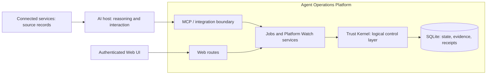

# Agent Operations Platform

**A production-oriented platform for governing AI-assisted workflows through durable state, explicit authority and controlled state transitions.**

Agents reason. The platform governs durable state changes and execution admission.

The platform supplies operational controls behind AI agents. **Jobs** is the complete reference application; **Platform Watch** provides report storage and controlled decisions. Both make the design concrete. This public edition contains synthetic examples and the implementation, with personal operational records excluded.

## Engineering problem

An assistant can interpret a message and propose an action. Durable business operations also need stable identity, controlled tool access, explicit authority, predictable retries and recovery across conversations. The Jobs lifecycle separates **Observation → Proposal → Admission**, so evidence and model confidence cannot silently become permission to mutate business state. Connected providers retain their original records; the platform owns its admitted application state.

## Architecture



TypeScript and Node.js implement the MCP/HTTP services, SQLite persistence and Web interface. Web routes and MCP tools reach shared application services. Provider adapters support bounded source access. See the [architecture and support matrix](docs/architecture/AGENT_OPERATIONS_PLATFORM.md) for the actual module boundaries.

## Trust Kernel and governed execution

**Trust Kernel** names the logical controls distributed across authentication, services, domain rules and persistence: identity, evidence, authority, policy, admission, human confirmation, idempotency, concurrency and audit records. It is not a separate runtime service or universal policy engine.

A lifecycle workflow reads attributable evidence, records an observation, proposes a valid transition, obtains the required explicit authority and admits against the current version. The caller then reads back the result. Domain gates reject unsupported or stale writes; configured identity and provider scopes bound access. A Skill supplies procedure, not permission. Human confirmation is required where a command contract specifies it; source text and model confidence cannot substitute for that authority.

## Core guarantees and evidence

| Guarantee | Where to inspect |
| --- | --- |
| Observation and proposal do not admit a lifecycle change | [Workspace service tests](tests/integration/workspace-service.test.ts) |
| Explicit authority and scoped identity | [Identity tests](tests/integration/web-identity.test.ts), [MCP boundary tests](tests/integration/mcp-transport.test.ts) |
| Exact retries are idempotent; stale writes fail | [Idempotency tests](tests/integration/idempotency.test.ts) |
| Deterministic transitions and derived tasks | [Lifecycle rules](src/domain/job-application-lifecycle.ts), [task tests](tests/integration/task-service.test.ts) |
| Durable state, backup and recovery | [Persistence](src/persistence/database.ts), [backup tests](tests/integration/database-backup.test.ts) |
| Source evidence is minimized and does not grant authority | [Mail privacy tests](tests/integration/gmail-observation-privacy.test.ts), [Skills design](docs/architecture/WORKSPACE_SKILLS_LAYER_PROPOSAL.md) |

Guarantees apply to the implemented commands. Platform write idempotency is not an exactly-once guarantee for external tools, and local recovery does not prove distributed workflow recovery. The [Trust Kernel evidence map](docs/architecture/AGENT_OPERATIONS_PLATFORM.md#trust-kernel-mechanisms-evidence-and-limits) links each control to code, tests and its limits.

## Applications and supported interfaces

| Area | Current implementation | Boundary |
| --- | --- | --- |
| Jobs | Evidence-backed lifecycle, tasks, preparation, screening and assessments | A concrete reference application, not a record of personal job-search activity |
| Platform Watch | Reports, evidence references and explicit user decisions | Offline pilot materials are not an autonomous agent runner |
| ChatGPT and Web | Host-specific handoffs, MCP tools and authenticated Web routes | Live account and deployment acceptance remain separate from synthetic tests |
| Integrations | Gmail, GitHub source reading, Drive-linked evidence and MCP contracts | Demonstrates integration patterns; no claim of arbitrary enterprise connectors |
| Additional agents/domains | Architectural direction | Codex/Claude acceptance, delegated grants and a general scheduler are not claimed as delivered |

The [delegated sandbox-agent design](docs/architecture/SANDBOX_AGENT_AUTHORITY_DESIGN.md) remains a proposal. “Production-oriented” describes the engineering approach, not a claim of enterprise scale or production certification.

## Run the synthetic end-to-end demo

Requires Node.js 24 and npm. Start in this repository directory:

```text
npm ci
npm run demo:synthetic
```

The demo uses the real application service and a fresh temporary SQLite database. It records a synthetic recruiter response, proposes a transition, rejects missing authority, admits with explicit confirmation, checks a no-write retry, rejects a stale write and reopens the database to verify persisted state and a derived task. It never reads your runtime database or contacts an external service.

The deterministic result is `RECRUITER_CONTACT`, lifecycle version `2`, and one `RESPOND_TO_RECRUITER` task. See [the walkthrough](docs/examples/SYNTHETIC_DEMO.md).

## Repository structure

| Path | Purpose |
| --- | --- |
| `src/domain/`, `src/application/` | Rules, admission and shared services |
| `src/mcp/`, `src/auth/`, `src/web/` | MCP, identity and web boundaries |
| `db/migrations/` | Complete ordered schema evolution |
| `tests/` | Unit, integration and synthetic acceptance checks |
| `fixtures/synthetic/` | Public demo inputs and reviewed Watch snapshots |
| `deploy/cloud/` | Parameterized deployment, backup and recovery tooling |
| `docs/adr/`, `docs/architecture/` | Decisions, technical contracts and labeled proposals |

## Running locally

For an interactive synthetic server, use a new database outside this repository. PowerShell:

```powershell
$demoData = Join-Path ([IO.Path]::GetTempPath()) ("paw-local-demo-" + [guid]::NewGuid())
New-Item -ItemType Directory -Path $demoData | Out-Null
$env:PAW_DB_PATH = Join-Path $demoData "workspace.db"
npm run seed
npm run dev
```

`/healthz` checks liveness; `/mcp` exposes the local MCP interface. Web access and general web writes are disabled by default. Development identity is for isolated local use; configure the deployment identity and transport boundary before exposing a service.

## Verification

```text
npm run verify
npm run test:public
npm run check:public
node --test experiments/platform-watch/pilot.test.mjs
```

`verify` runs server/browser type checks, the test suite and the build. The clean-edition baseline passed **522 tests in 64 files**; test count is not a coverage percentage. Packaging tests expect a Git checkout. `check:public` requires **Gitleaks 8.30.1** on PATH (or `GITLEAKS_BIN`) and fails if the scanner is unavailable. CI installs the pinned scanner and enforces the public-data gate. See [verification scope](docs/VERIFICATION.md) and the [current positioning report](docs/PUBLIC_REPOSITIONING_REPORT.md).

## Privacy, limitations and design documents

See [public-data policy](docs/PUBLIC_DATA_POLICY.md), [sanitisation report](docs/PUBLIC_SANITISATION_REPORT.md), [core workflow](docs/architecture/CORE_JOB_WORKFLOW.md) and [documentation index](docs/INDEX.md).

Formerly **Personal AI Workspace (PAW)**. Existing `PAW_*` configuration, `workspace_*` tools, package identity and database defaults are intentionally retained for compatibility. Installed connectors may keep the old display name. [Naming and portfolio boundaries](docs/architecture/AGENT_OPERATIONS_PLATFORM.md#naming-and-compatibility) explain the historical terminology and separate AgentGov project.

This edition contains no original Git history. Local synthetic checks do not establish real-account access, hosted scheduled execution, second-client acceptance or enterprise production readiness. Private deployment evidence is deliberately excluded from this portfolio.
