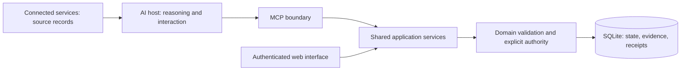

# Personal AI Workspace

**A durable state and governance layer for AI-assisted work.** Conversation is an interface; Workspace owns records, evidence and admitted state changes.

The first domain is job search. This public edition contains synthetic examples and the full implementation, with private operational records excluded. It is derived from a system used in practice; the demo below demonstrates local behavior, not production or hosted-agent acceptance.

## Engineering problem

An assistant can interpret a message and propose an action. Reliable execution also needs stable identity, durable records, an explicit authority boundary and predictable retries across conversations. Workspace separates **Observation → Proposal → Admission**, so evidence and model confidence cannot silently become permission to mutate business state.

## Architecture



TypeScript and Node.js implement the MCP/HTTP services, SQLite persistence and a secondary web interface. Connected services retain ownership of their original records. Workspace persists relevant facts, references and business state; it does not need chat memory to reconstruct them.

## Core guarantees and evidence

| Guarantee | Where to inspect |
| --- | --- |
| Observation and proposal do not admit a lifecycle change | [Workspace service tests](tests/integration/workspace-service.test.ts) |
| Explicit authority and scoped identity | [Identity tests](tests/integration/web-identity.test.ts), [MCP boundary tests](tests/integration/mcp-transport.test.ts) |
| Exact retries are idempotent; stale writes fail | [Idempotency tests](tests/integration/idempotency.test.ts) |
| Deterministic transitions and derived tasks | [Lifecycle rules](src/domain/job-application-lifecycle.ts), [task tests](tests/integration/task-service.test.ts) |
| Durable state, backup and recovery | [Persistence](src/persistence/database.ts), [backup tests](tests/integration/database-backup.test.ts) |
| Source evidence is minimized and does not grant authority | [Mail privacy tests](tests/integration/gmail-observation-privacy.test.ts), [Skills design](docs/architecture/WORKSPACE_SKILLS_LAYER_PROPOSAL.md) |

The runtime checks remain authoritative even when a Skill prescribes an execution procedure. The [delegated sandbox-agent design](docs/architecture/SANDBOX_AGENT_AUTHORITY_DESIGN.md) is a **proposal**, not a shipped authority system.

## Run the synthetic end-to-end demo

Requires Node.js 24 and npm. Start in this repository directory:

```text
npm ci
npm run demo:synthetic
```

The demo uses the real application service and a fresh temporary SQLite database. It records a synthetic recruiter response, proposes a transition, rejects missing authority, admits with explicit confirmation, checks a no-write retry, rejects a stale write and reopens the database to verify persisted state and a derived task. It never reads your runtime database or contacts an external service.

The deterministic result is `RECRUITER_CONTACT`, lifecycle version `2`, and one `RESPOND_TO_RECRUITER` task. See [the walkthrough](docs/examples/SYNTHETIC_DEMO.md).

## Repository structure

| Path | Purpose |
| --- | --- |
| `src/domain/`, `src/application/` | Rules, admission and shared services |
| `src/mcp/`, `src/auth/`, `src/web/` | MCP, identity and web boundaries |
| `db/migrations/` | Complete ordered schema evolution |
| `tests/` | Unit, integration and synthetic acceptance checks |
| `fixtures/synthetic/` | Public demo inputs and reviewed Watch snapshots |
| `deploy/cloud/` | Parameterized deployment, backup and recovery tooling |
| `docs/adr/`, `docs/architecture/` | Decisions, technical contracts and labeled proposals |

## Running locally

For an interactive synthetic server, use a new database outside this repository. PowerShell:

```powershell
$demoData = Join-Path ([IO.Path]::GetTempPath()) ("paw-local-demo-" + [guid]::NewGuid())
New-Item -ItemType Directory -Path $demoData | Out-Null
$env:PAW_DB_PATH = Join-Path $demoData "workspace.db"
npm run seed
npm run dev
```

`/healthz` checks liveness; `/mcp` exposes the local MCP interface. Web access and general web writes are disabled by default. Development identity is for isolated local use; configure the deployment identity and transport boundary before exposing a service.

## Verification

```text
npm run verify
npm run test:public
npm run check:public
node --test experiments/platform-watch/pilot.test.mjs
```

`verify` runs server/browser type checks, the original test suite and the build. `check:public` requires **Gitleaks 8.30.1** on PATH (or `GITLEAKS_BIN`) and fails if the scanner is unavailable. CI installs the pinned scanner and checks every proposed change. See [verification scope](docs/VERIFICATION.md).

## Privacy, limitations and design documents

See [public-data policy](docs/PUBLIC_DATA_POLICY.md), [sanitisation report](docs/PUBLIC_SANITISATION_REPORT.md), [core workflow](docs/architecture/CORE_JOB_WORKFLOW.md) and [documentation index](docs/INDEX.md).

This edition contains no original Git history. Local synthetic checks do not establish real-account access, hosted scheduled execution, second-client acceptance or enterprise production readiness. Private deployment evidence is deliberately excluded from this portfolio.
